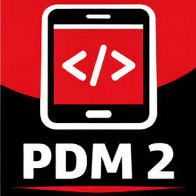

# 📘 Programação para Dispositivos Móveis II

Repositório com os arquivos PDM2 das aulas apresentados em sala.

---

## 📚 Conteúdo das aulas

### 🟢 Módulo 1 — Fundamentos

- [APP Quiz](quiz)
---

## ⚠️ Observações

- Este material é de apoio às aulas
- Os exemplos e explicações completas são apresentados em sala

---

## 👨‍🏫 Professor Parisotto

Material desenvolvido para uso em aula.
